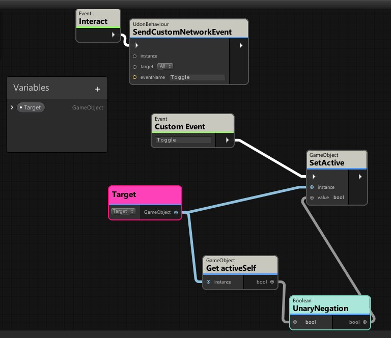
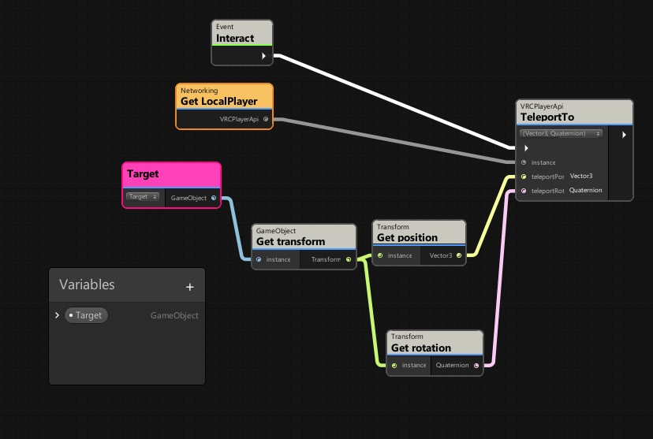
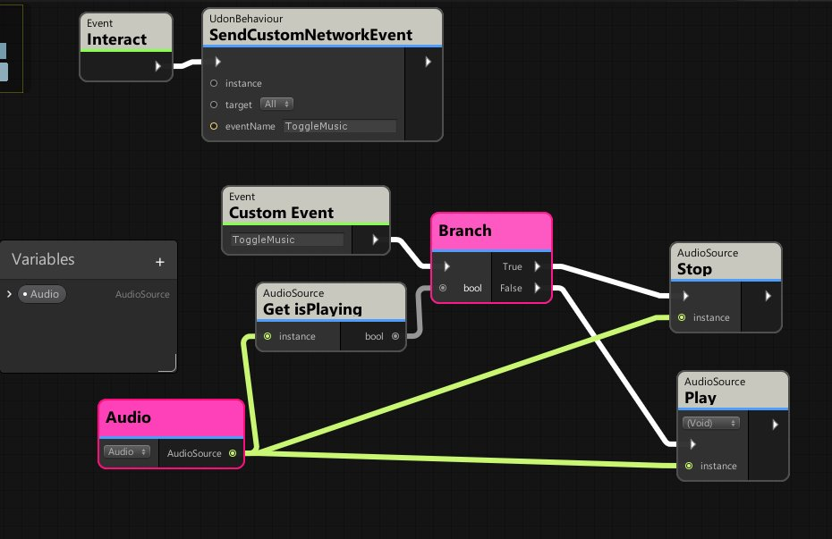
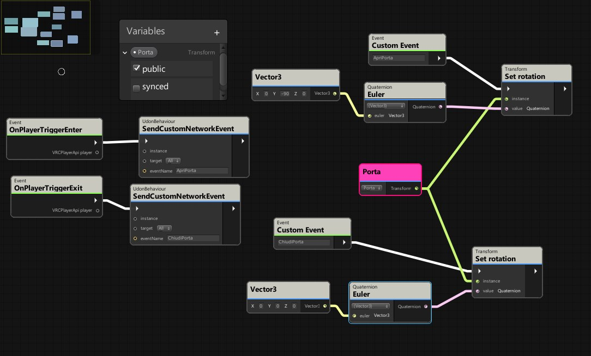
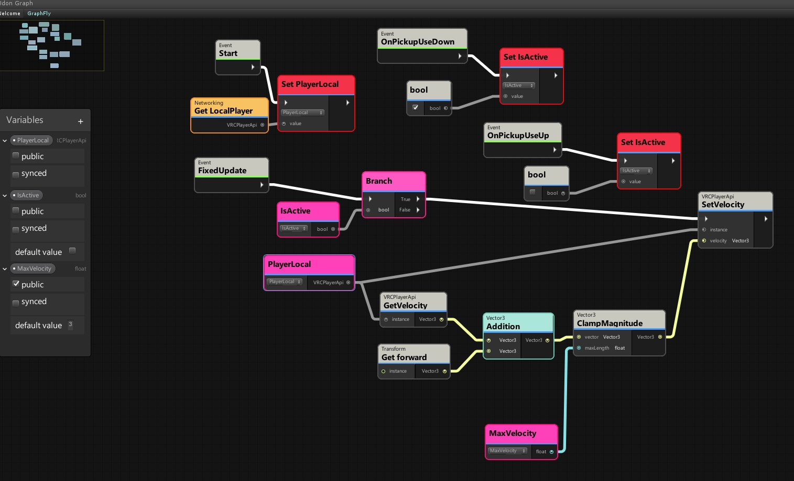

In questa cartella i seguenti script

* Fai apparire sparire un oggetto:

[U_ClickReveal.cs UDON#](U_ClickReveal.cs)

* Script di teleport
  
  [U_ClickTeleport.cs UDON#](U_ClickTeleport.csReveal.cs)

* Script accendi/spegni musica

[U_ClickToggleSound.cs](U_ClickToggleSound.cs)

* Script per rotazione porta

[U_TriggerRotazione.cs](U_TriggerRotazione.cs)

* Script di volo
  
  [FlyingObject.cs](../5.meeting26maggio%20building/FlyingObject.cs)